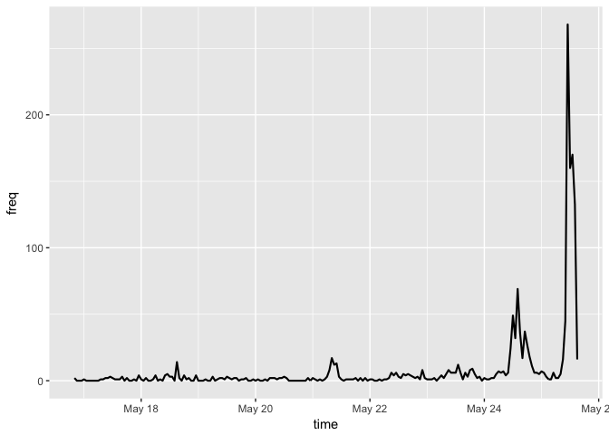
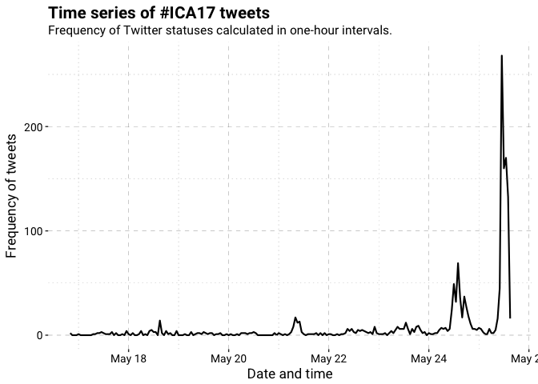
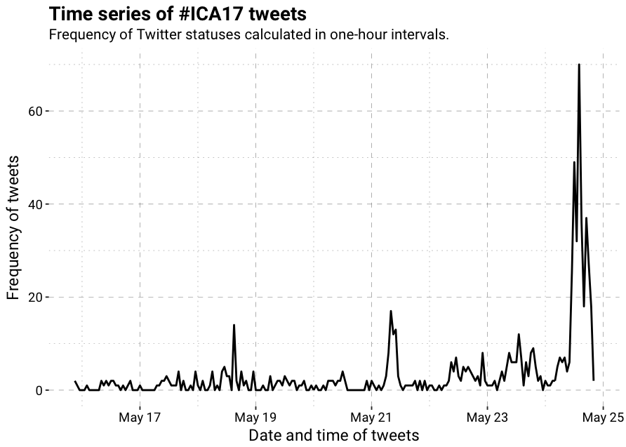
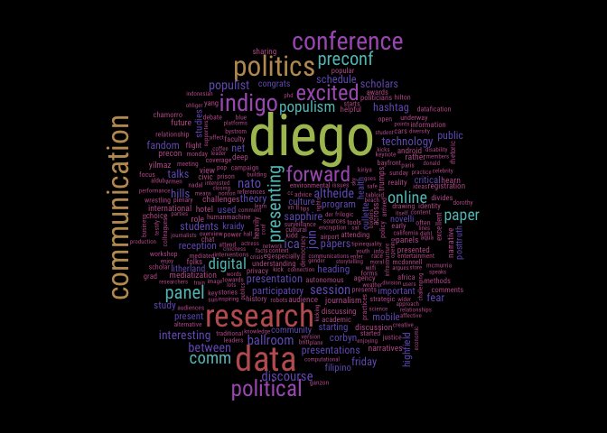
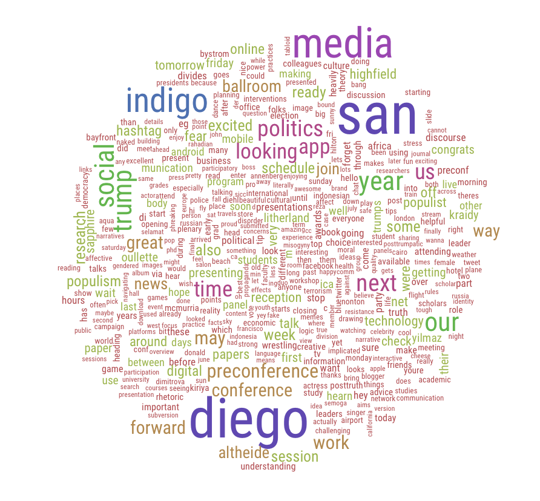
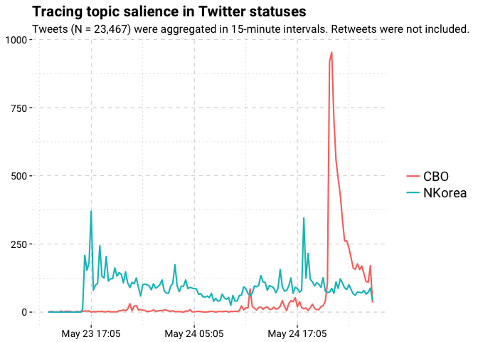
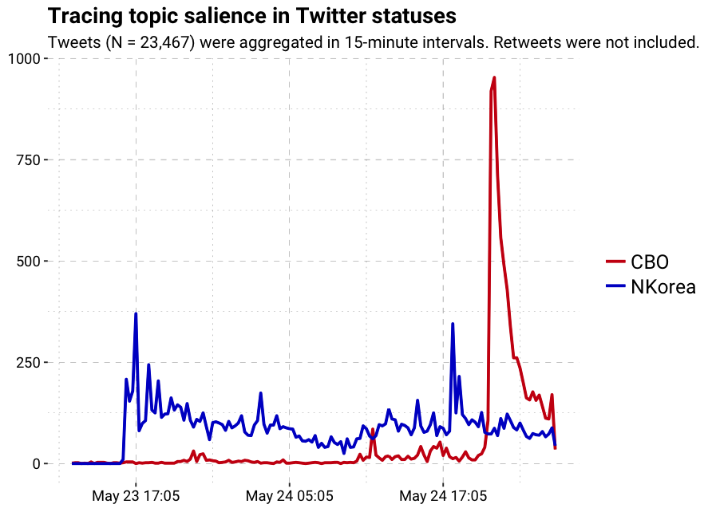
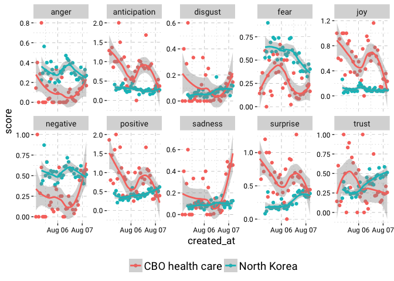

# Intro to rtweet

## Twitter data

Twitter data was already trendy, but the unpresidented 2016 U.S. 
election has elevated it to a fever pitch. One of the biggest drivers 
of the trend is the widespread availability of Twitter data. Twitter 
makes much of its user-generated data freely available to the public 
via Application Program Interfaces (APIs). APIs refer to sets of 
protocols and procedures for interacting with sites. Twitter maintains
several APIs. The two most condusive to data collection are the REST 
API and the stream API, both of which I describe below.

Twitter's REST API provides a set of protocols for exploring and 
interacting with Twitter data related to user statuses (tweets), user 
profiles and timelines, and user network connections. The data are 
restful in that they have been archived by Twitter. Navigating these 
resting endpoints can, at times, be resource intensive, but it also 
makes it possible to perform highly complex and specific queries.

Twitter data not yet archived and accessible via the REST API can be 
accessed using Twitter's stream API. As its name suggests, the stream 
API provides users with a live stream of Twitter data. Because the 
data are streamed, or pushed, to the user, the stream API reduces 
overhead associated with performing queries on archived data sources. 
This makes it possible to collect large amounts of data very quickly 
and with relatively little strain on computational resources. The 
downside to the stream API is that it is limited to prospective 
(tracking, monitoring, etc.) but not retrospective (surveying, 
searching, etc.) queries.

## Installing rtweet

Install from CRAN using `install.packages`.


```r
## install from CRAN
install.packages("rtweet")
```

Alternatively, install the most recent [development] version from
Github using `install_github` (from the devtools package).


```r
## install from Github (dev version)
if (!"devtools" %in% installed.packages()) {
    install.packages("devtools")
}
devtools::install_github("mkearney/rtweet", build_vignettes = TRUE)
```

## Authorizing access to Twitter's APIs

I've tried to make the API token [oauth] process as painless as
possible. That's why I've included the "auth" vignette, which ships
with the package and contains step-by-step instructions on how to
create and manage your Twitter API token. The vignette also includes
instructions for saving a token as an environment variable, which
automates the token-loading process for all future sessions (at least,
for the machine you're using). View the
[authorization vignette online](https://mkearney.github.io/rtweet/articles/auth.html)
or enter the following code into your R console to load the vignette locally:


```r
## Open Twitter token vignette in web browser.
vignette(topic = "auth", package = "rtweet")
```

## Package documentation

In addition to the API authorization vignette, rtweet also includes a
[brief package overview vignette](https://mkearney.github.io/rtweet/articles/intro.html)
as well as a
[vignette demonstrating how to access Twitter's stream API](https://mkearney.github.io/rtweet/articles/stream.html). To
open the vignettes locally, use the code below.


```r
## overview of rtweet package
vignette(topic = "intro", package = "rtweet")

## accessing Twitter's stream API
vignette(topic = "stream", package = "rtweet")
```

And thanks to [pkgdown](https://github.com/hadley/pkgdown), rtweet 
now has a dedicated
[package documentation website](https://mkearney.github.io/rtweet). 
*Btw, while I'm on the subject of package documentation/maintenance, 
I'd also like to point out
[rtweet's Github page](https://github.com/mkearney/rtweet). 
Contributions are welcome and if you run into any bugs or other 
issues, users are encouraged to
[create an Github issue](https://github.com/mkearney/rtweet/issues).

## Searching for tweets

Searching for tweets is easy. For example, we could search for all 
[publically] available statuses from the past 7-10 days that use the 
hashtags `#ica17` or `#ica2017`. In the code below I've specified
18,000 statuses (tweets), which is the maximum number a user may 
request every 15 minutes.


```r
## load rtweet
library(rtweet)

## search for tweets containing ICA17 or ICA2017 (not case sensitive)
ica17 <- search_tweets(
    "#ica17 OR #ica2017", n = 18000, include_rts = FALSE
)
```

If there were more than 18,000 statuses that (a) fit the search query
and (b) exist in the last 7-10 days (the limit put in place by 
Twitter), then users can continue where they left off by using the 
`max_id` parameter. Since Twitter statuses are returned in order from 
newest to oldest, the `max_id` value should just be the last status ID
returned by the previous search.


```r
## select last (oldest) status ID from previous search
last_status_id <-  ica17$status_id[nrow(ica17)]

## pass last_status_id to max_id and run search again.
ica17_contd <- search_tweets(
    "#ica17 OR #ica2017", n = 18000, include_rts = FALSE,
    max_id = last_status_id
)
```

### Tweets data

Data returned by `search_tweets` is quite extensive. One recently
added feature makes navigating the data a bit easier. As of version 
0.4.3, *rtweet* returns `tibble` data frames (assuming the user has
installed the *tibble* package, which is a dependency for nearly 
all packages in the tidyverse). Tibbles are especially nice when 
working with larger data sets because accidental printing in R has
been known to take years off of one's life (needs citation).

#### ts_filter and ts_plot

Included in the rtweet package are a few convenenience functions, 
which have been designed to assist in the analysis of Twitter data.
One of these convenient functions is `ts_plot`, which is a 
plot-based wrapper around `ts_filter`. The `ts_plot` and `ts_filter` 
functions aggregate the frequency of tweets over specified intervals
of time. Hence, the "ts" (time series) naming convention. In addition 
to aggregating the frequency of statuses, `ts_plot` will also 
plot the time series.


```r
## aggregate freq of tweets in one-hour intervals
agg <- ts_filter(ica17, by = "hours")

## view data
agg
```

```
## # A tibble: 212 x 3
##                   time  freq filter
##                 <dttm> <dbl>  <chr>
##  1 2017-05-16 20:00:00     2       
##  2 2017-05-16 21:00:00     0       
##  3 2017-05-16 22:00:00     0       
##  4 2017-05-16 23:00:00     0       
##  5 2017-05-17 00:00:00     1       
##  6 2017-05-17 01:00:00     0       
##  7 2017-05-17 02:00:00     0       
##  8 2017-05-17 03:00:00     0       
##  9 2017-05-17 04:00:00     0       
## 10 2017-05-17 05:00:00     0       
## # ... with 202 more rows
```

```r
## plot data
ts_plot(agg)
```

<!-- -->

The plot produced by `ts_plot` depends on whether the user has 
installed *ggplot2*, which is a suggested but not required package 
dependency for *rtweet*. If you haven't installed *ggplot2* then 
I highly recommend it. Assuming you have, then the object returned
by `ts_plot` can be treated like any other ggplot object, meaning
you can easily add layers and customize the plot to your liking.


```r
## load ggplot2
library(ggplot2)
```


```r
## plot a time series of tweets, aggregating by one-hour intervals
p1 <- ts_plot(ica17, "hours") +
    labs(
        x = "Date and time",
        y = "Frequency of tweets",
        title = "Time series of #ICA17 tweets",
        subtitle = "Frequency of Twitter statuses calculated in one-hour intervals."
    ) +
    ## a custom ggplot2 theme I mocked up for ICA
    theme_ica17()

## render plot
p1
```

<!-- -->

<!-- <p align="center">

</p> -->

## Analyzing text

The second convenenience function for analysing tweets is
`plain_tweets`. As you might guess, `plain_tweets` strips the text of
the tweets down to plain text. Because there are already variables included 
in the default tweets data that contain links, hashtags, and mentions, those 
entities are stripped out of the text as well. What's returned are lower 
case words. Below I've applied the function to the first few ICA17 tweets.


```r
## strip text of tweets
plain_tweets(ica17$text[1:3])
```

```
## [1] "excellent posttruth preconference heres some background"
## [2] "panel w"                                                
## [3] "nato"
```

The `plain_tweets` function is relatively straight forward at cutting
through the clutter, but it still may not prepare you for quick and
easy analysis. For that, you can use the `tokenize` argument in
`plain_tweets`. The tokenize argument will return a vector of plain 
text words for each tweet.


```r
## tokenize by word
wrds <- plain_tweets(ica17$text, tokenize = TRUE)
wrds[1:3]
```

```
## [[1]]
## [1] "excellent"     "posttruth"     "preconference" "heres"        
## [5] "some"          "background"   
## 
## [[2]]
## [1] "panel" "w"    
## 
## [[3]]
## [1] "nato"
```

This can easily be converted into a word count [frequency] table, but 
it still leaves one problem. The most common words probably aren't going 
to tell us a lot about our specific topic / set of tweets.


```r
## get word counts
wrds <- table(unlist(wrds))

## view top 40 words
head(sort(wrds, decreasing = TRUE), 40)
```

```
## 
##           the            to            of           and            in 
##           614           504           429           388           363 
##           for            on            at             a            is 
##           290           284           247           235           181 
##          from         media         about            as           san 
##           121           115           111           110           110 
##          with         diego            be             i          this 
##           108           105            98            92            91 
##            we            by           you           are           our 
##            90            88            85            78            76 
## preconference            my            it        social          that 
##            75            71            66            65            63 
##          data           not           see      research communication 
##            61            60            59            55            52 
##           now           but            up         great            us 
##            51            50            50            49            49
```

See, these words don't appear to be very unique to ICA 2017. Of course, we could always
find a premade list of stopwords to exclude, but those may not appropriately reflect
the medium (Twitter) here. With rtweet, however, it's possible to create your own
dictionary of stopwords by locating overlap between (a) a *particular* sample of
tweets of interest and (b) a more *general* sample of tweets. 

To do this, we're going to search for each letter of the alphabet separated
by the boolean ` OR `. It's a bit hacky, but it returns massive amounts of 
tweets about a wide range of topics. So, if we can identify the *unique* words 
used in our sample, we may yet accomplish our goal. 

In the code below, I've excluded retweets since those add unnecessary 
redundancies (and, ideally, we'd want a diverse pool of tweets). It's 
still not perfect, but it gives us a systematic starting point that 
I imagine could be developed into a more reliable method.


```r
## construct boolean-exploiting search query
all <- paste(letters, collapse = " OR ")

## conduct search for 5,000 original (non-retweeted) tweets
sw <- search_tweets(all, n = 5000, include_rts = FALSE)
```


```r
## create freq table of all words from general pool of tweets
stopwords <- plain_tweets(sw$text, tokenize = TRUE)
stopwords <- table(unlist(stopwords))
```

Now that we've identified the frequencies of words in this more general pool 
of tweets, we can exclude all ICA tweet words that appear more than N number of 
times in the general pool.


```r
## cutoff
N <- 5L

## exclude all ica17 words that appear more than N times in stopwords
wrds <- wrds[!names(wrds) %in% names(stopwords[stopwords > N])]

## check top words again
head(sort(wrds, decreasing = TRUE), 40)
```

```
## 
##         diego preconference          data      research communication 
##           105            75            61            55            52 
##      politics    conference        indigo     political       excited 
##            48            42            40            37            36 
##       forward         panel       preconf    presenting          comm 
##            34            29            29            29            26 
##        online         paper       digital      populism      ballroom 
##            25            24            23            23            19 
##     discourse           ica          nato       session      altheide 
##            19            19            19            19            18 
##       between          join      populist   interesting         hills 
##            18            18            18            17            16 
##    technology          fear        friday       hashtag        papers 
##            16            15            15            15            15 
##  presentation      sapphire      schedule      scholars      students 
##            15            15            15            15            15
```

That turned out well! These words look a lot more unique to the
topic. We can quickly survey all of these words with a simple word cloud.


```r
## get some good colors
cols <- sample(rainbow(10, s = .5, v = .75), 10)

## plot word cloud
par(bg = "black")
suppressWarnings(wordcloud::wordcloud(
    words = names(wrds),
    freq = wrds,
    min.freq = 5,
    random.color = FALSE,
    colors = cols,
    family = "Roboto Condensed",
    scale = c(4, .25))
)
```

<!-- -->

<!-- <p align="center">

</p> -->

## Tracking topic salience

If we wanted to model the topics of tweets, we could conduct two
searches for tweets over the same time period and then compare the
frequencies of tweets over time using time series. That's what I've 
done in the example below.

First I searched for tweets mentioning "North Korea", since I know 
they conducted another missile test on Monday.


```r
## search tweets mentioning north korea (missle test on Monday)
nk <- search_tweets(
    "north korea", n = 18000, include_rts = FALSE
)
```

Then I searched for tweets mentioning "CBO health care" (in any order, 
anywhere in the tweet), since I know the CBO was released on Wednesday.


```r
## search for tweets about the CBO (released on Wed.)
cbo <- search_tweets(
    "CBO health care", n = 18000, include_rts = FALSE
)
```

And then I combined the two data sets into one big data frame.


```r
## create query (search) variable
cbo$query <- "CBO health care"
nk$query <- "North Korea"

## row bind into single data frame
df <- rbind(cbo, nk)
```

Using the `ts_plot` function, I then provide a list of `filter` words 
(via regular expression; the bar is like an "OR"). Use the `key` argument 
if you want to have nicer looking filter labels. By default `ts_plot` 
will create groups based on the text of the tweet and the filters provided. 
However, you can pass along the name of any variable in DF and the function 
will use that to classify groups. In the code below, I applied `plain_tweets`
to the text to create a new variable, and then specified that I wanted to 
apply the filters to that variable by using the `txt` argument in `ts_plot`.


```r
## create plain tweets variable
df$text_plain <- plain_tweets(df$text)

## filter by search topic
p3 <- ts_plot(
    df, by = "15 mins",
    filter = c("cbo|health|care|bill|insured|deficit|budget",
               "korea|kim|jung un|missile"),
    key = c("CBO", "NKorea"),
    txt = "text_plain"
)
```

Now it's easy to add more layers and make this plot look nice.


```r
## add theme and more style layers
p3 <- p3 + 
    theme_ica17() +
    scale_x_datetime(date_labels = "%b %d %H:%m") +
    theme(legend.title = element_blank()) +
    labs(x = NULL, y = NULL, 
         title = "Tracing topic salience in Twitter statuses",
         subtitle = paste("Tweets (N = 23,467) were aggregated in 15-minute",
                          "intervals. Retweets were not included.")
    )

## render plot
p3
```

<!-- -->

<!-- <p align="center">

</p> -->


## Get sentiment analysis


```r
## conduct sentiment analysis
sa <- syuzhet::get_nrc_sentiment(df$text_plain)
```


```r
## view output
tibble::as_tibble(sa)
```

```
## # A tibble: 23,467 x 10
##    anger anticipation disgust  fear   joy sadness surprise trust
##    <dbl>        <dbl>   <dbl> <dbl> <dbl>   <dbl>    <dbl> <dbl>
##  1     1            0       0     1     0       1        0     0
##  2     0            0       0     0     0       0        0     1
##  3     0            0       0     0     0       1        1     0
##  4     0            0       0     0     0       1        1     0
##  5     0            0       0     0     0       1        1     0
##  6     0            0       0     0     0       0        0     0
##  7     0            1       0     0     0       0        0     1
##  8     0            0       0     0     0       0        0     0
##  9     0            0       0     0     0       1        1     0
## 10     0            0       1     0     0       1        0     0
## # ... with 23,457 more rows, and 2 more variables: negative <dbl>,
## #   positive <dbl>
```

```r
## bind columns
df <- cbind(df, sa)
```

## Aggregating features of Twitter statuses using dplyr


```r
## load dplyr
suppressPackageStartupMessages(library(dplyr))

## create function for aggregating date-time vectors
round_time <- function(x, interval = 60) {
    ## round off to lowest value
    rounded <- floor(as.numeric(x) / interval)
    ## center so value is interval mid-point
    rounded <- rounded + round(interval * .5, 0)
    ## return to date-time
    as.POSIXct(rounded * interval, origin = "1970-01-01")
}

## use pipe (%>%) operator for linear syntax
long_emotion_ts <- df %>%
    ## select variables (columns) of interest
    dplyr::select(created_at, query, anger:positive) %>%
    ## convert created_at variable to desired interval 
    ## here I chose hours (60 seconds * 60 mins = 1 hour)
    mutate(created_at = round_time(created_at, 60 * 60)) %>%
    ## transform data to long form
    tidyr::gather(sentiment, score, -created_at, -query) %>%
    ## group by time, query, and sentiment
    group_by(created_at, query, sentiment) %>%
    ## get mean for each grouping
    summarize(score = mean(score, na.rm = TRUE))

## view data
long_emotion_ts
```

```
## Source: local data frame [720 x 4]
## Groups: created_at, query [?]
## 
## # A tibble: 720 x 4
##             created_at           query    sentiment     score
##                 <dttm>           <chr>        <chr>     <dbl>
##  1 2017-08-06 07:00:00 CBO health care        anger 0.1428571
##  2 2017-08-06 07:00:00 CBO health care anticipation 1.2857143
##  3 2017-08-06 07:00:00 CBO health care      disgust 0.0000000
##  4 2017-08-06 07:00:00 CBO health care         fear 0.1428571
##  5 2017-08-06 07:00:00 CBO health care          joy 1.0000000
##  6 2017-08-06 07:00:00 CBO health care     negative 0.0000000
##  7 2017-08-06 07:00:00 CBO health care     positive 1.8571429
##  8 2017-08-06 07:00:00 CBO health care      sadness 0.0000000
##  9 2017-08-06 07:00:00 CBO health care     surprise 1.0000000
## 10 2017-08-06 07:00:00 CBO health care        trust 0.1428571
## # ... with 710 more rows
```


```r
## plot data
long_emotion_ts %>%
    ggplot(aes(x = created_at, y = score, color = query)) + 
    geom_point() + 
    geom_smooth(method = "loess") + 
    facet_wrap(~ sentiment, scale = "free_y", nrow = 2) + 
    theme_ica17() + 
    theme(legend.position = "bottom", 
          axis.text = element_text(size = 9),
          legend.title = element_blank()) + 
    scale_x_datetime(date_breaks = "18 hours", date_labels = "%b %d")
```

<!-- -->


And that's it!
